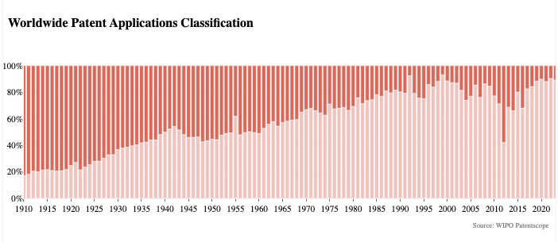
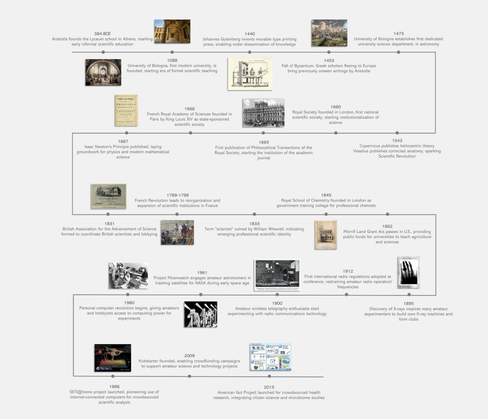
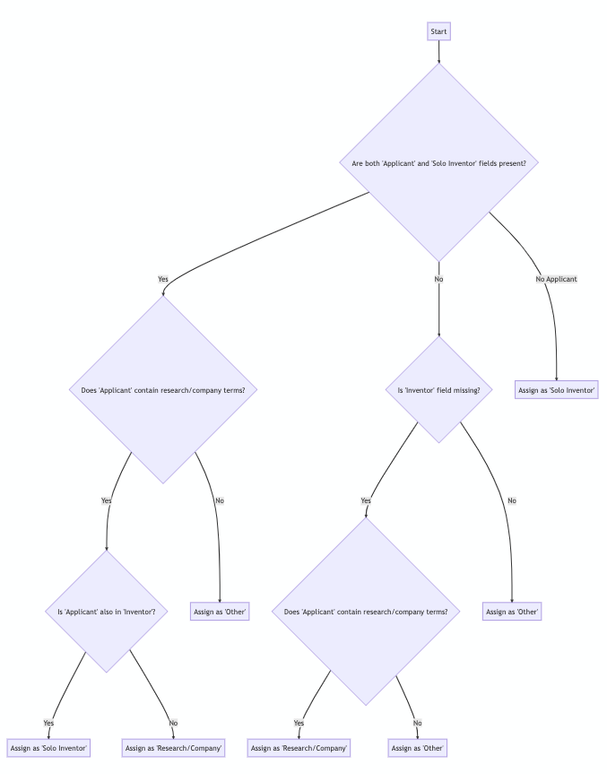

# Introduction

In 1962 physicist and historian of science [Derek de Solla Price](https://en.wikipedia.org/wiki/Derek_J._de_Solla_Price) gave a series of lectures in which he divided the whole history of science into two distinct periods: he called them little science and big science [@Price1963].

Little science, according to Price, encompassed the whole period of scientific activity that occurred prior to the [Scientific Revolution](https://en.wikipedia.org/wiki/Scientific_Revolution). Before this inflection point, scientific endeavors were carried out on a small scale by people working independently or in small groups, and were either self-funded or supported by rich patrons. 

Big science, characterized by ambitious and highly complex research conducted by large numbers of scientists and carried out with the support of institutions like universities and governments, emerged in the 20th century. Though government-funded research did increase throughout the Scientific Revolution and the Industrial Revolution as the possible applications of scientific research became increasingly ambitious, 20th century projects like the space race and the Manhattan Project exemplify the world-changing technology that big science was built to produce. 

The emergence of big science changed many things about the way scientific knowledge was produced, and those changes have had lasting impacts. Price argued that the extensive institutionalization of science through the 20th century created the conditions for the current paradigm of scientific advancement, in which the boundaries of scientific knowledge expand incrementally through the accumulation of isolated discoveries, rather than through the emergence of paradigm-shifting theories. 

The central role that the government and private industry play in funding big science, and the vast bureaucracy that allocates that funding, have led to a scientific process that is more hierarchical and less autonomous than the scientific process of previous eras. These dynamics are exacerbated by the increasingly arduous standards set by academic institutions and journals that all players in the field must meet in order to participate in mainstream science. 

Despite these challenges, a devoted lineage of amateurs have continued to expand their fields from outside of the academy. In the last 60 years, new pathways have emerged for interested amateurs to contribute to large-scale scientific projects, and many have found ways to dialogue with professional scientists in their field. Recent developments in technology and increased access to scientific knowledge have spurred several movements calling for a more transparent and democratic scientific paradigm. **These changes prompt the question: are we on the verge of a renaissance in amateur science?**

This article features original research on patents, interviews with case study subjects, and discussion of secondary sources such as the [Stanford Encyclopedia of philosophy](https://plato.stanford.edu) [@zalta95], scholarly articles on the history of science, and Bowler and Morus’ textbook on the subject, Making Modern Science [@Bowler2020].

# The Long Reign of the Natural Philosopher

"Science" in the modern sense refers both to an agreed-upon body of knowledge about the world, and to the distinct set of practices by which that knowledge is created. The concept of the scientific method is now so synonymous with the idea of science that it might be confusing to think of the activities of pre-modern researchers and natural philosophers as "science", especially as they overlap with epistemological systems now considered to be unscientific, such as astrology, theology, and alchemy. But curious people have been doing some version of science, i.e., discovering new things about the world and using these discoveries to solve practical problems, since the formation of the earliest civilizations. 

The modern version of the scientific method was established a few hundred years ago during the scientific revolution, but some of its component parts date back to the emergence of [natural philosophy](https://en.wikipedia.org/wiki/Natural_philosophy) in Ancient Greece. Natural philosophy was the earliest form of what we might call scientific practice. Natural philosophers, such as [Plato](https://en.wikipedia.org/wiki/Plato) and [Aristotle](https://en.wikipedia.org/wiki/Aristotle), made detailed observations about the world and attempted to use their findings to generate more general hypotheses about the nature of reality [@Williams2000].

This approach was inherently interdisciplinary. Natural philosophers were attempting to answer big, existential questions using all the tools they had at their disposal, and the bodies of work produced by these scholars were often wide-ranging and heterogenous, drawing on direct observation, religious texts, mathematics, intuition, folk wisdom, and formal logic.

Plato’s discovery of the deductive method was central to the development of science as we now know it, and laid the groundwork for his student Aristotle, who completed the earliest known formal study of logic in history, [the Organon](https://en.wikipedia.org/wiki/Organon). Aristotle’s discovery of inductive reasoning and emphasis on empiricism make him perhaps the most significant figure in the development of modern science before the 17th century. He also made founding contributions to the fields that would become physics, astronomy, geology, biology, zoology, and psychology, as well as setting the stage for centuries of productive engagement with these ideas throughout the Byzantine Empire and the Islamic Empire, long after Western Europe had plunged into the Dark Ages after the fall of Rome [@Kraut2022].

## Case Study: Aristotle

Aristotle joined Plato’s Academy when he was 17 or 18 and stayed in Athens until his late 30s. After leaving Athens he traveled, including a trip with one of his students to the isle of Lesbos, where they studied the animals, insects, plants, and environmental conditions of two lagoons on the island, writing three books on his theories of the origins of animals and their relationship to the environment. He was invited back to Macedonia, his birthplace, to be a tutor to the king’s son (who would go on to take the throne as Alexander the Great), and later tutored two other future-kings, Ptolemy and Cassander. Eventually he moved back to Athens and established his own school, called Lyceum, where he taught courses for the next 12 years. He is thought to have produced the bulk of his body of work during that time [@Shields2022].

# Golden Eras and Dark Ages

The fall of Rome in the 5th century distanced Western Europe from the intellectual legacies of [Classical Antiquity](https://en.wikipedia.org/wiki/Classical_antiquity), marking the beginning of a period of declining scholarship in the West. On the other hand, scholars in China, India, and the Middle East continued making important discoveries in the fields of astronomy, medicine, physics, and mathematics over the next 12 centuries. Golden eras and dark ages came and went as the Byzantine and Islamic empires grew, building schools, libraries, civic and religious institutions, and then fell into periods of decline. Aristotle’s manuscripts were translated into Latin and brought to Medieval Europe starting in the 11th century, which sparked a renewed interest in the knowledge of the ancients. In particular, translations of Aristotle’s work on logic, which were brought to Europe by Greek scholars fleeing Constantinople after it fell to the Turks in the 15th century, introduced the idea of deduction and empiricism to Western scientists and set the stage for the Scientific Revolution to come.

Scientists of classical antiquity and the Middle Ages, though amateurs, were usually educated, either as a student in a philosopher’s school, a religious institution or, later on, at a university. The 11th and 12th centuries saw the emergence of the first European universities. These academic institutions mainly trained students to become doctors, lawyers, or priests, but students were also required to study grammar, rhetoric, logic, arithmetic, astronomy, geometry, and music. The scientists of the Middle Ages spent much of their time engaging in dialogue with scholars in a wide range of disciplines, and most scientific progress before the 16th century was achieved by individuals reading texts (and commentary on those texts), and then conducting their own experiments and writing their own books and commentaries in response. 

Since all science was being produced by "amateurs" rather than professionals, once an aspiring scientist was educated they had to find a way to support their research. Some were from wealthy or aristocratic families, and so did their research alongside familial and political obligations. Others took jobs at universities, or in the government or church. And some found a patron who was willing to support their work. Many pursued their interests independent of (and sometimes directly against the wishes of) the institutions they were embedded within. 

## Case Study: Roger Bacon

[Bacon](https://en.wikipedia.org/wiki/Roger_Bacon) was a 13th-century scientist and early champion of the empirical method. After earning his Master’s degree at Oxford he took a job as a teacher, lecturing on Latin grammar, Aristotelian logic, arithmetic, geometry, and the mathematical aspects of astronomy and music. In his mid-life he spent about a decade as an independent scholar, then became a friar in the Franciscan order. Soon after joining, a new prohibition against members of his order publishing books or pamphlets without prior approval from the Catholic bureaucracy prevented him from engaging in his studies. 

Eventually he found a patron to support his work. This patron encouraged him to keep writing, but to keep his activities a secret. As was typical of scientists of Bacon’s era, his work included writing on a plethora of subjects including linguistics, morality, empiricism, mathematics, optics, alchemy, astronomy, and how to incorporate Aristotelian logic into theology [@Hackett2022].

# The Rise of the Gentleman Scholar

Of the many transformations which took place in the 15th century, three of the most significant to the history of amateur science were the invention of the [printing press](https://en.wikipedia.org/wiki/Printing_press) in 1440, the [fall of Byzantium in 1453](https://en.wikipedia.org/wiki/Fall_of_Constantinople), and the discovery of the ["New World"](https://en.wikipedia.org/wiki/New_World) in 1492. In each case, new ideas, new ways of thinking, and new methods for organizing society were developed, culminating in a widespread and systematic reorganization of human thought: the Scientific Revolution. 

Many historians consider 1543 to be the beginning of the Scientific Revolution. Two books published that year would set off an unprecedented period of scientific development. One was [*De Humani Corporis Fabrica*](https://en.wikipedia.org/wiki/De_Humani_Corporis_Fabrica_Libri_Septem) (On the Workings of the Human Body) by Andreas Vesalius [@vesalius1543humani]. This work critiqued and updated the theory of anatomy proposed by [Galen](https://en.wikipedia.org/wiki/Galen), the legendary physician and philosopher from Ancient Greece whose writing on anatomy had prevailed for over a century. The other was [*De Revolutionibus Orbium Coelestium*](https://en.wikipedia.org/wiki/De_revolutionibus_orbium_coelestium) (On the Revolutions of the Celestial Spheres) by Nicolaus Copernicus, which made a compelling mathematical case for [heliocentrism](https://en.wikipedia.org/wiki/Heliocentrism) and consequently turned the world upside with its religious implications. Luckily for Copernicus, the book was published while he was on his deathbed, which allowed him to avoid the (likely devastating) personal consequences that he would have faced from the Church for proposing the heretical theory that the Earth was not at the center of the Universe.

Scientific activity proliferated and scientific discoveries accelerated rapidly over the next 100 years. In the mid-17th century, amateur scientists formed scientific academies and societies. Previously, scientific communication had largely happened privately via letters, but meeting in person had several advantages: talking in a group made it easier to keep up with the pace of discoveries, which was becoming harder to do. And due to the increasing emphasis on the empirical method, any experiment needed trustworthy witnesses to confirm the results: the higher the status of the witness, the more credible their testimony. The members of the more prestigious academies felt a need to defend their positions as the arbiters and able practitioners of the "new science". Thus, participation in these groups was limited to ["gentleman scholars",](https://en.wikipedia.org/wiki/Independent_scientist) (and their rich patrons), whose social standing and pedigree were signals of the veracity and trustworthiness of their findings.

Within a few years of their formation, the academies began to collect and publish regular reports of the experiments they’d heard about in their vast network of correspondents. These reports, which were the precursor to the modern academic journal, were essentially a scientific news service, certifying, broadcasting, and archiving news about what was happening in the emerging scientific communities. These publications also engaged the public, who began to take an interest in scientific matters. Ironically, the publication of scientific journals by these exclusive clubs likely had a hand in popularizing science and whetting the public’s appetite to engage in scientific experimentation. Though the members of scientific societies were also amateurs – wealthy landowners or young urban bourgeoisie who participated in science as a hobby – a hierarchy of amateurs was emerging.

Throughout the 18th and 19th centuries, scientific societies spread through Europe. As they gained social prominence, they became increasingly exclusive, authoritative, and elite. The founding of the prestigious [École polytechnique in Paris](https://fr.wikipedia.org/wiki/%C3%89cole_polytechnique_(France)) at the end of the 18th century represented the first monumental investment by a government in an institution that would begin to educate students in the new methods of scientific discovery. The École Polytechnique, founded during the French Revolution, was originally a technical school that trained students to become civil and military engineers. This landmark investment was an endorsement of the idea that French scientists had been pitching the government on since the founding of the Royal Society: that funding scholars who could then apply the scientific method to the problems of society could offer a significant return on investment. 

Government support for the "new science" in other nations, however, was slow to emerge. Universities still largely adhered to religious doctrine, and continued on with the curriculum that had been developed in the Middle Ages. Private laboratories, gardens and museums formed to give more structure to the activities of the societies, but science remained largely in the purview of gentleman amateurs and their patrons. 

## Case Study: Mary Anning

[Mary Anning](https://en.wikipedia.org/wiki/Mary_Anning), a working class woman in Dorset, England, collected and sold fossils she found on the beach. Despite her few years of formal education, she studied all the writing on paleontology that she could find, and eventually became well known for her skill of identifying, classifying, and drawing the specimens she found. Her collection was renowned among fossil-lovers throughout England (the first complete Plesiosaurus was one of her most significant finds), including the members of the [Geological Society of London](https://en.wikipedia.org/wiki/Geological_Society_of_London), to whom she regularly sold her fossils. As a working-class woman, however, she was unable to take part in any of the activities of the society. It was not uncommon for her to sell a fossil to a member of a society who would then fail to credit her in the article he published about the specimen [@Rafferty2023].

# The Emergence of the Professional Scientist

The beginning of the 19th century was a lively time for the growing community of middle and working class Europeans who had taken an interest in science. New societies like [The Société Astronomique de France](https://en.wikipedia.org/wiki/Soci%C3%A9t%C3%A9_astronomique_de_France) sprang up as amateur-friendly alternatives to the Royal Academies. In industrial regions of England like Manchester, working-class amateur naturalists gathered in pubs to discuss botany and zoology, and all across Europe extensive amateur meteorological observation networks sprang up, gathering data used by the emerging professional field of meteorology [@Lingelbach2011].

It was also a time of conflict, as amateur scientists began to push back against the limitations that both governments and scientific societies imposed. Amateur astronomers in France argued for a more democratic approach to astronomy, allowing for wider public involvement in research through activities like tracking meteor showers, and amateur archaeologists in Germany, Prussia, and France organized to protest legislation that required permits for excavations, limiting the freedom to study ancient archaeological sites. 

Trained scientists were also beginning to chafe against the academies’ control over funding and the production of knowledge. Societies like the British Association for the Advancement of Science coordinated scientists nationwide and lobbied governments for funding and recognition, attempting to transform science from an activity for wealthy hobbyists to a government-funded professional institution whose advances could be systematized and applied for the benefit of society. 

Their petitions worked – increases in the institutional support for science led to the creation of more technical schools, and to government scientific agencies like geological surveys, physics labs and health institutes. The first modern PhD programs, in which professors were expected to train their students to produce independent research while conducting their own research, were established in Germany in the early 19th century. Scientific disciplines continued to organize into specialized departments, schools, and journals. By the late 19th century, most scientists worked in academic or government settings, not as independent gentlemen. 

The changes in scientific institutions that occurred in the 19th century reflect the social and material transformations caused by the Industrial Revolution. The stark and growing divisions between socioeconomic classes and the miraculous possibilities of the machine age that co-occurred initiated an ongoing public debate about social inequality and the distribution of power and resources in society. Many people saw science and technology as tools that could be used to address social inequality, but opinions differed widely on the best way to apply them [@Grantham2011].

# Big Science: The Last 100 Years

Over the previous 300 years, science had become indispensable to the functioning of the modern world, but it had also become increasingly tied to, and reliant on, political and economic power structures. Throughout the 20th century scientific institutions became increasingly intertwined with government and industry. Funding for science in this period was abundant but increasingly focused on applied research, which was becoming more specialized.

The 20th century also witnessed the escalating influence of science and industry on world events. The First World War intensified the development of research to advance military capability, spurring massive projects like the Manhattan Project for the atomic bomb and later the space race, projects which proved instrumental in the outcomes of World War II and the Cold War era, respectively. Scientific research became a strategic imperative leveraged by governments worldwide; many countries formally institutionalized science as a national priority, establishing dedicated policy bodies like the U.S. National Science Foundation in 1950. 

The growth of research in government, private and academic settings accelerated the institutionalization of science, and led to a steady decline in the popularity of amateur science. Our research into worldwide patent applications over the course of the 20th century illustrates this shift. \autoref{fig1} highlights the relative proportion of patent applications filed by private companies, public research centers, and universities, as compared to patent applications filed by individual researchers. The steady increase in applications by institutions, and the decrease in applications filed by solo inventors, continues nearly unbroken for over 100 years.

Relative proportion of worldwide patent applications classified by research/company and solo inventor from 1910 to 2023. The data shows an initial predominance of Solo Inventor patents and the steady increase of Research/Company patents during the mid-20th century, showing the professionalization of science. See \autoref{appendixa} for more detail on the methodology used. 

Though the scientific institutions of the 20th century had become more open to women and ethnic minorities, amateurs were more marginalized than ever. A few fields maintained a role for amateur involvement: astronomers and naturalists in particular continued making new discoveries in their fields, and tinkering with radio and electrical systems in home workshops was a popular hobby for many amateur inventors. But compared to professional scientists, amateur research was given little credit or legitimacy during this period, and the tools needed to conduct cutting-edge research in many fields were totally inaccessible to the lay public

# The Rebirth of Amateur Science

Big science continued to expand through the second half of the 20th century, but several social and political movements that focused on the lack of public involvement in science policy forced scientific institutions to accept more input from the public on research agendas. The environmental movement, the anti-nuclear movement, and HIV/AIDS activists all fought to create ways to involve the public in setting priorities for scientific research and assessing the risks of new technologies. These groups demanded more oversight over scientific research, more public buy-in, more communication, and more decision making power for the people impacted by new scientific products. AIDS activists, for example, became well-versed in the drug development process and successfully argued for changes to the FDA’s policies on testing and distributing experimental treatments. They also demanded changes to the conditions in which clinical tests were carried out, lobbied the CDC to broaden the definition of AIDS to include symptoms and outcomes that were more commonly diagnosed in women, and helped found alternative research facilities such as Boston’s Community Research Initiative (1987) [@AccessHealthMA2022].

Though these movements failed to significantly alter the broader structures underlying scientific establishments, they did serve to empower amateurs and activists, giving rise to the citizen science movement, a massive network of amateurs engaged in data collection and analysis on a staggering scale. Amateur engagement through field observation and data collection have existed for over a century, particularly in the environmental sciences and astronomy, but the development of digital technology in recent decades has made it possible to efficiently collect and process data from tens of thousands of citizen scientists, further expanding the possibilities of big science. More recently citizen science has expanded into fields like social science and health [@Bonney2014].

## Case Study: Aella

[Aella](https://en.wikipedia.org/wiki/Aella_(writer)) (a pseudonym) is a well-known writer and sex researcher. She is unique, even among amateur scientists, for her lack of formal education. She grew up in rural Idaho, where she was homeschooled, and attended college for one semester before dropping out. She has never taken a college-level science class, and her knowledge of data collection, data analysis, survey design and psychology is entirely self-taught. She has a community of friends (many of whom are trained statisticians and engineers) who can answer questions and offer feedback about her work. In 2022, she published a survey about sexual fetishes and kinks that now has over 600,000 responses, making it one of the largest (if not the largest) surveys of its kind ever done. She has done studies on a wide array of subjects, including categories of enlightenment, relationship types, and social taboos. She publishes her findings and makes her data available to all on her [Substack](https://aella.substack.com) [@Aella2021].

## Case Study: The Four Thieves Vinegar Collective

[The Four Thieves Vinegar Collective](https://en.wikipedia.org/wiki/Four_Thieves_Vinegar_Collective) was founded in 2015 with the goal of increasing access to essential generic medications like insulin and epinephrine by producing them using DIY techniques. Named after a legend about a group of medical students who broke into pharmacies to redistribute medicine to the poor, the decentralized collective aims to make medications affordable by developing open source protocols for safely synthesizing drugs at home. Their first major project was developing an open source recipe for Daraprim, an AIDS medication whose price was controversially raised over 50-fold in 2015. The following year, when the pharmaceutical company Mylan raised the price of EpiPens from $57 to $318, they published DIY instructions for a $30 "EpiPencil" autoinjector that could be easily made at home using common materials. By publicizing alternative production methods, the collective hopes to undermine monopolies and empower patients worldwide through decentralizing pharmaceutical production [@Oberhaus2018;@FourThievesVinegar].

## Case Study: Slime Mold Time Mold

This pseudonymous collective of scientists has been writing [a blog about nutrition and the obesity epidemic](https://slimemoldtimemold.com) since 2020. Though they haven’t publicly identified as either amateurs or academics ("There isn’t one single answer for our background, because we are a hive mind/collaboration"), their articles feature collaborations and exchanges with amateurs and academics alike. In 2022 they recruited over 200 people to take part in the "All-Potato Diet", in an effort to find evidence for their theory on the role of lithium in the obesity epidemic. 64 participants finished the month-long experiment. The results of the experiment, and a six-month follow-up, can be found on their blog [@slimemoldtimemold2023].

When asked in an interview what kind of impact they hope to make with their research, they wrote:

> We’d like science to be more diverse — more kinds of people, doing more kinds of science, using more kinds of methods and paradigms, in more kinds of communities and institutions, and communicating their work in more and more different ways. We also want to usher in a 21st century scientific revolution. Ambitious research is possible, both inside and outside of institutions. We’d like this to be our impact, but also it doesn’t really matter since we think that at some level this is inevitable. Authority is brittle, it requires constant attention — the natural state of science is chaos. 

## Case Study: Seeds of Science

[Seeds of Science](https://www.theseedsofscience.org/) is an open-access journal founded by a collaborative team including a psychology professor, a physics PhD, and science enthusiasts. It aims to offer a publishing platform for non-traditional researchers without constraints of conventional academic formats. 

Seeds of Science believes in talent beyond university walls: The journal aspires to be a hub for disenfranchised scientists and individuals outside academia, facilitating collaboration, mentorship, and publication. Despite hurdles such as conforming to academic indexing standards and database inclusion, Seeds of Science remains committed to its mission. The journal advocates for a more inclusive and diverse scientific community, where unconventional ideas and speculative research can flourish. By challenging traditional gatekeeping mechanisms, they aspire to cultivate a culture that values open inquiry and fosters the next generation of innovative thinkers.

# Conclusion

*21st Century Science*

Since the 1980s and the beginning of home computing, new technologies have allowed amateurs to participate once again in many scientific fields through large-scale crowdsourcing, citizen science projects, and open online collaborations between amateurs and professionals. It’s possible that we’re entering a new era, where the new tools for collecting, storing, analyzing, and displaying data, and for funding and publishing research make scientific research accessible to the public in new ways.  Many of these tools and platforms have been created as a part of the Open Access and Decentralized Science (or DeSci) movements.

The Open Access movement began around 2000 with the goal of making scientific knowledge more accessible to all. Early Open Access pioneers created new journals that didn’t have paywalls, removing the financial and institutional barriers that prevented non-professionals from accessing new scientific literature. However, these publications supplemented their lost income from subscriptions by instituting large fees for authors and institutions, merely moving the cost of access to the scientists and institutions looking to publish. A new movement, known as Diamond or Platinum Open Access emerged in the 2010s, and used institutional funding and volunteer labor to create publishing platforms for scientific research that were free for both researchers and readers. 

DeSci is a new set of methods for doing scientific research that doesn't rely on traditional centralized institutions like universities or government labs. Instead, it leverages distributed networks, open collaborations, and decentralized technologies to democratize access, enable global participation, and facilitate peer-to-peer validation of scientific claims and data. Desci aims to accelerate scientific progress by removing barriers, increasing transparency, and incentivizing contributions from a broader pool of researchers and citizen scientists worldwide. It uses decentralized autonomous organizations (DAOs), open science frameworks, and web3 technologies. These decentralized blockchain-based protocols allow researchers to self-organize into projects, validate each other's work through peer review, and get funding from distributed sources [@EthereumDesci].

As we enter the 21st century, powerful new technological tools and the emergence of innovations in the field of open science offer amateurs perhaps the greatest opportunity since the Scientific Revolution to directly participate in expanding the frontiers of knowledge. Just outside the gates of big science, where scores of professionals conduct their research under the purview of governments, universities, and corporations, there are countless amateurs, conducting their own research and contributing to the dream of a more democratic, decentralized science. 

# Appendix A: Methodology for classifying patents {#appendixa}

The dataset in \autoref{figstat} was obtained by web scraping the WIPO PatentScope website from 1910 to 2023. For each year we scraped the first 99 pages from the database each year (~200 patents per page), creating a sample of around 19,800 patents per year before cleaning and preprocessing. Patents were sorted using the "Relevance" criterion, an algorithm applied to keyword searches (see Guide [here](https://patentscope.wipo.int/search/help/en/BM25scoring.pdf)). As no keywords were searched (only the publication year), the displayed patents are considered to be randomly sampled. Due to computational constraints, patents were scraped without delving into each individual patent. This approach limited the extraction of fields such as “Applicant” and “Inventor” to only the first row, possibly causing the observed fluctuations during the years 2010–2017. Patents were classified into three types: `Solo Inventor`, `Research/Company`, or `Other`.  These fields usually appear in the first row of the patent description. If this wasn't the case, or if the classification was unclear, the patent was `Other`. Other patents, typically unclear, were omitted from the analysis. Research/Company patents included applicants from private industries, research centers, and universities, while Solo Inventor patents had individuals as applicants. The relative proportions of the two patent types were calculated for each year and displayed as stacked bars using the Plotly Express library in Python, executed by and compiled into a MyST-formatted integrated research article [@Dupre2022-iro] by NeuroLibre [@Karakuzu2022-nlwf;@Harding2023-conp].

Below is a more detailed breakdown of the decision tree used for classifying patents into `Solo Inventor`, `Research/Company`, or `Other`:  

# References